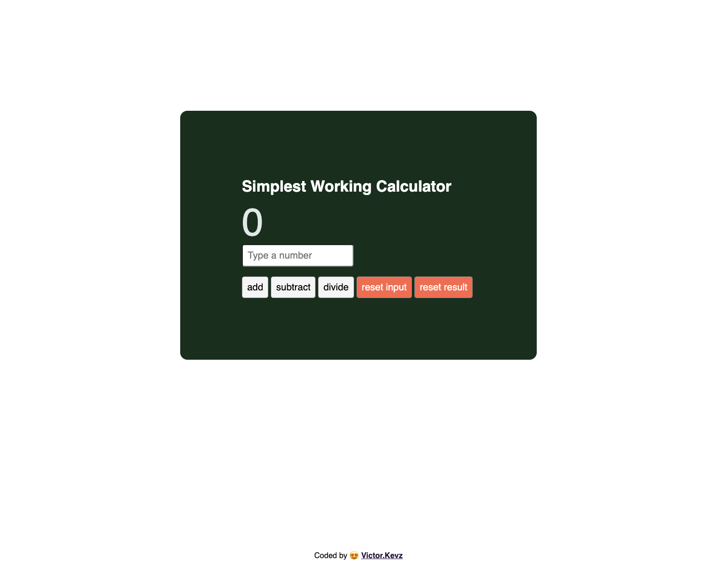

# Simple Calculator

This is a simple calculator app built using React.js. It allows users to perform basic arithmetic operations such as addition, subtraction, multiplication, and division.

## Features

- Addition: Allows users to add a number to the current result.
- Subtraction: Allows users to subtract a number from the current result.
- Multiplication: Allows users to multiply the current result by a number.
- Division: Allows users to divide the current result by a number.
- Reset Input: Clears the input field.
- Reset Result: Resets the result to zero.

## Usage

1. Enter a number into the input field.
2. Click on one of the operation buttons (add, subtract, multiply, divide) to perform the corresponding operation.
3. The result will be updated accordingly.
4. To reset the input field, click on the "Reset Input" button.
5. To reset the result to zero, click on the "Reset Result" button.

## Installation

1. Clone the repository:

```
git clone https://github.com/VictorKevz/simple-calculator.git
```

2. Navigate to the project directory:

```
cd simple-calculator
```

3. Install dependencies:
npm create vite@latest
select React
select Javascript
npm install
```

4. Start the development server:

npm run dev
```

5. Open your browser and visit `http://localhost:3000` to view the application.

## Technologies Used

- React.js: For building the user interface and managing component-based architecture.
- CSS: For styling the components and implementing layout responsiveness.

## Credits

- **Developer:** Victor.Kevz
- **GitHub:** [Victor.Kevz](https://github.com/VictorKevz)

## License

This project is licensed under the [MIT License](https://opensource.org/licenses/MIT).